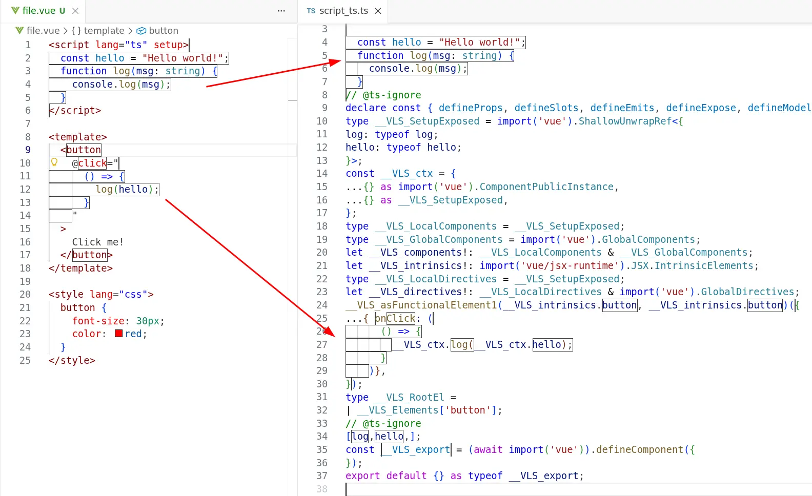
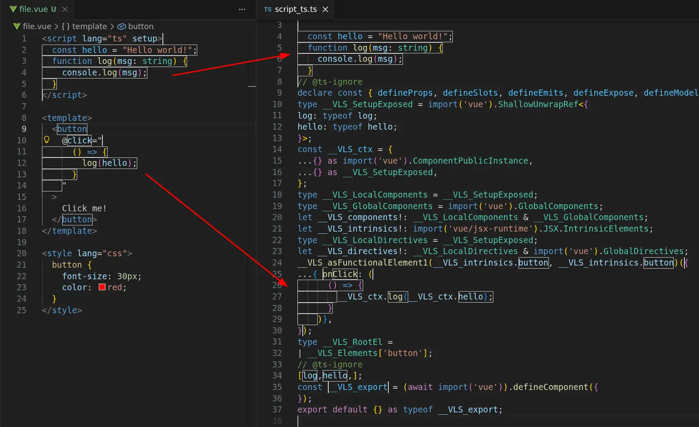
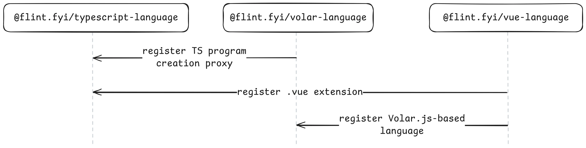
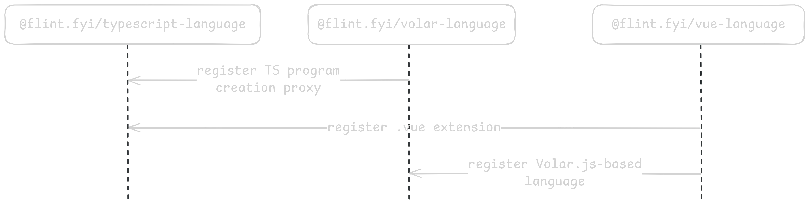
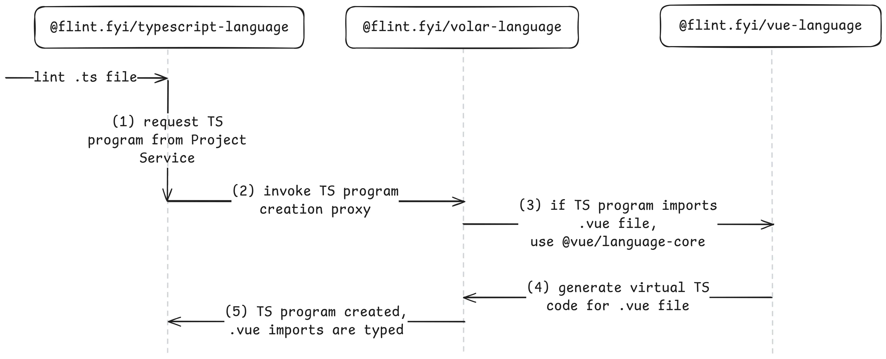
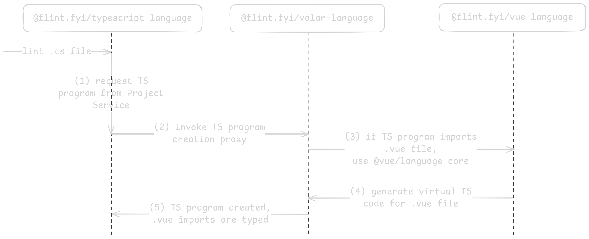

---
authors:
  name: auvred
  title: Maintainer
  picture: /team/auvred.webp
  url: https://github.com/auvred
date: 2026-03-18
excerpt:
  Traditional approaches to linting TypeScript-based languages have had significant drawbacks for many years.
  They're often difficult to configure and come with limitations that prevent rules from fully understanding the types of code.
  Flint introduces a comprehensive Volar.js-based architecture that enables fully type-aware lint rules for languages like Astro, Svelte, and Vue.
  Learn how Flint's architecture solves this once and for all!
title: Full Type-Aware Linting for Astro, Svelte, and Vue
---

## What are TypeScript-based languages?

Frontend frameworks often introduce their own languages that extend basic TypeScript syntax with custom features.
JSX-based frameworks like React and Solid.js natively work with the TypeScript compiler's `.jsx` and `.tsx` file support.
But more extensive frameworks like Astro, Solid, and Vue that add language-specific additions and non-standard file extensions need more tooling to work well with TypeScript.

Traditional linters such as ESLint have been able to work with those languages on a _syntax-only_ level.
They can use the languages' provided parsers to get an AST for the languages' contents and report errors purely based on that AST.

However, syntax-only linting is often not enough to catch all bugs.
[Type-aware linting](https://typescript-eslint.io/blog/typed-linting) allows for significantly more powerful lint rules -- but requires more deep integrations with TypeScript tooling.

We're excited to say that Flint is the first modern linter with full support for typed linting on extension languages.
Flint uses Volar.js to integrate TypeScript with extension languages, giving lint rules access to full type information even in embedded JavaScript expressions within language-specific files.
This represents a big leap forward in linting for these languages.

## `no-unsafe-*` rules and embedded JavaScript expressions

This applies to all type-aware rules, but `@typescript-eslint/no-unsafe-*` rules break more often than others.
The problem is that imports from files with custom extensions aren't supported by TypeScript natively.
So all imports from [`.astro`](https://github.com/ota-meshi/eslint-plugin-astro/issues/348), [`.svelte`](https://github.com/sveltejs/eslint-plugin-svelte/issues/1150), or [`.vue`](https://github.com/vuejs/vue-eslint-parser/issues/104) files are resolved to `any` when files are parsed using `@typescript-eslint/parser`.

:::note
[Yosuke Ota](https://github.com/ota-meshi)'s [`typescript-eslint-parser-for-extra-files`](https://github.com/ota-meshi/typescript-eslint-parser-for-extra-files) made progress on providing type information on TypeScript-based language files in ESLint.
See the library's documentation for more issues and excellent prior art.
:::

Another major user-facing problem is that embedded JavaScript expressions in extension languages can't be linted with type information.
For example, traditional linters would not be able to determine type information in the following Vue snippet to know whether the `log(hello);` call is safe.

:::note
Vue is used in illustrations and examples throughout this post, but similar logic and rules apply for all other TypeScript-based languages.
:::

```vue {11-13} /(?<!console.)log/ "hello"
<script lang="ts" setup>
	function log(msg: string) {
		console.log(msg);
	}
	const hello = "Hello world!";
</script>

<template>
	<button
		@click="
			() => {
				log(hello);
			}
		"
	>
		Click me!
	</button>
</template>
```

Notice how the `@click` event listener is a JavaScript expression that uses variables declared in `<script>`.
In order to lint this JavaScript expression _properly_, we need the ability to resolve the types used inside it.

Resolving types in extension languages is a difficult technical challenge.
Unfortunately, it's not solveable by straightforward techniques like concatenating all JavaScript expressions into one big file.
Embedded JavaScript expressions rely on many language-specific quirks that must be taken into account.

Take, for example, the following code that uses a custom Vue component:

```vue "data"
<template>
	<MyComponent v-slot="{ data }">
		{{ data.text }}
	</MyComponent>
</template>
```

`data` comes from `MyComponent`'s `v-slot`.
To know its type, we must resolve the type of `MyComponent`, extract its `v-slot` type, and so on.
This is why naive concatenation wouldn't work.

[Johnson Chu](https://github.com/johnsoncodehk)'s [`tsslint`](https://github.com/johnsoncodehk/tsslint) used Volar.js to solve this problem, though the first problem (`any`-typed imports) is still present.

## Type Checking TypeScript-Based Extension Languages

At some point, every TypeScript-based-language author wants to type-check their language with TypeScript.
There are two main difficulties here:

1. Getting TypeScript to perform type-checking of syntax it's unaware of (so they do not get skipped or throw errors)
2. Resolving custom file extensions in TypeScript's existing module resolution system (so they are not resolved to `any`)

Even though TypeScript can be extended with [Language Service Plugins](https://github.com/microsoft/TypeScript/wiki/Writing-a-Language-Service-Plugin), these plugins can't add new custom syntax to TypeScript.
Moreover, plugins extend the _editing experience only_, i.e., they can't be used in CLI workflows, such as `tsc --noEmit`.

That's why TypeScript-based-language authors were required to invent hacks that could force TypeScript to understand their custom languages.

Several different approaches to this problem exist, but one of them stands out...

## Volar.js

It all started as part of the Vue Language Tools initiative!

[Johnson Chu](https://github.com/johnsoncodehk/) developed the outstanding language support for Vue.js, and then they noticed the pattern that could be decoupled from Vue Language Tools to support almost any possible TypeScript-based language.

This is how Volar.js, the "Embedded Language Tooling Framework", was created.

What does "embedded" mean?

Well, take for example a Vue Single File Component (SFC):

```vue
<script lang="ts" setup>
	const hello = "Hello world!";
	function log(msg: string) {
		console.log(msg);
	}
</script>

<template>
	<button
		@click="
			() => {
				log(hello);
			}
		"
	>
		Click me!
	</button>
</template>

<style lang="css">
	button {
		font-size: 30px;
		color: red;
	}
</style>
```

As you may have noticed, this file contains blocks with three different languages: TypeScript (`<script lang="ts">`), HTML (`<template>`), and CSS (`<style lang="css">`).
The HTML block also has an embedded TypeScript/JavaScript expression inside it.

The purpose of Volar.js is to provide language tool authors with a high-level framework that handles all the complexities -- such as LSP integration, routing of LSP requests to the appropriate embedded language service, type-checking powered by TypeScript, and much more -- so that they can avoid reinventing this _difficult_ wheel again.

But we're particularly interested in its type-checking abilities.

Volar.js allows language authors to create "language plugins" which serve two important purposes:

- They describe custom file extensions
- They translate custom language syntax into pure TypeScript code that can be type-checked by the TypeScript compiler

### How Volar.js Works

:::tip
Volar.js ships a nice VS Code extension called [Volar Labs](https://volarjs.dev/core-concepts/volar-labs/).
It's helpful in showing how custom syntax is translated into TypeScript code.
:::

Here's a screenshot showing a `file.vue` source file on the left, compared to the generated `script_ts.ts` equivalent on the right.
All of `file.vue`'s embedded JavaScript expressions, including code from its `<script>` block, are merged into that single TypeScript file.

<div class="only-light">



</div>

<div class="only-dark">



</div>

Transforming the file in this way allows its variables to be fully type-checkable.
For example, variables declared in `<script setup>` are prefixed with `__VLS_ctx.` when used in `<template>`.
Thanks to this, the type of every identifier used in the `@click` handler can be resolved to its actual value in tooling such as type-aware linting.

This is how [`vue-tsc`](https://github.com/vuejs/language-tools/tree/94907be4f056f25867e46a117ab18d2782b425d7/packages/tsc) type-checks `.vue` files internally!

## How Flint utilizes Volar.js for type-aware linting

The new `@flint.fyi/volar-language` package allows creating TypeScript-based languages with ease.
In order to add support for a new language, a plugin author must provide:

- A list of custom file extensions
- Volar.js language plugin
- Optional extra properties that are passed to the rule context

We will explore three stages of linting.

### Initialization

Initialization of a language happens implicitly.

Take a look at the example Flint config:

```typescript 'import "@flint.fyi/vue"'
// flint.config.ts
import { defineConfig } from "flint";
import "@flint.fyi/vue";

export default defineConfig({
	// ...
});
```

It may seem that nothing is happening here; however, `import '@flint.fyi/vue'` performs a few very important side-effects.

<div class="only-light">



</div>

<div class="only-dark">



</div>

Let's walk through these side-effects:

1. `@flint.fyi/vue` imports `@flint.fyi/vue-language`
1. `@flint.fyi/vue-language` imports `@flint.fyi/volar-language`
1. `@flint.fyi/volar-language` registers global TypeScript program creation proxy
1. `@flint.fyi/vue-language` registers `.vue` extension as supported by TypeScript globally
1. `@flint.fyi/vue-language` registers its Volar.js language plugin in a global list

At this point, every TypeScript program created by `@flint.fyi/typescript-language` supports `.vue` files _natively_.
Yes, it's that simple!

By importing `@flint.fyi/vue`, you enable _all TypeScript-only rules_ to support `.vue` linting.
No additional configuration needed!

### TypeScript program creation

`@flint.fyi/typescript-language` uses [TypeScript Project Service](https://typescript-eslint.io/blog/project-service/) internally.
Thanks to the Project Service, lint rules can request type information even for files that aren't included in `tsconfig.json`.

One of the important things that we considered when we were designing Volar.js integration was zero-config support for TypeScript-based languages in the Project Service.

Let's walk through how Flint does it.

<div class="only-light">



</div>

<div class="only-dark">



</div>

1. The stateful `@flint.fyi/typescript-language` has a single shared instance of the TypeScript Project Service.
When `@flint.fyi/typescript-language` gets a request to lint a certain file, it opens this file with Project Service.
Project Service looks through already opened TypeScript programs and searches for the requested file.
If no existing file is found, Project Service builds a new TypeScript program.
1. Thanks to Flint's implicit initialization, all TypeScript program creation requests are proxied through a special Flint hook.
If this hook finds out that the TypeScript program creation needs to be customized by `@flint.fyi/volar-language`, it relays the request to the Volar.js-specific hook.
`@flint.fyi/volar-language` has access to all Volar.js language plugins registered globally at the initialization stage.
It then uses Volar.js' [`proxyCreateProgram`](https://github.com/volarjs/volar.js/blob/44d58aee30d1d476c8ad3f6f5581b288d7185d1e/packages/typescript/lib/node/proxyCreateProgram.ts#L33) utility to enhance the default TypeScript program behavior with custom language support.
1. In our case, the Volar.js language plugin provided by [the official `@vue/language-core`](https://github.com/vuejs/language-tools/tree/94907be4f056f25867e46a117ab18d2782b425d7/packages/language-core) is registered by `@flint.fyi/vue-language` to be used to customize the TypeScript program creation.
1. When the TypeScript module resolution algorithm decides that it wants to load a `.vue` file, it relays the request to that Volar.js language plugin.
This way, all `.vue` files are loaded into the TypeScript program as if they were just `.ts` files.
1. And finally, `@flint.fyi/typescript-language` gets a newly created fully-functioning TypeScript program.

These TypeScript programs created by the Project Service are later used to perform the actual type-checking and type-aware linting.

### Linting

All Flint rules created from languages based on `@flint.fyi/volar-language` can lint `.ts` files as well.

Rule authors can distinguish between `.ts` and `.vue` files by the presence of the `services.vue` property.

For `.vue` files, `services.vue` provides the Vue SFC AST as well as other handy items.

```typescript /services.vue(?= )/ "sfc"
ruleCreator.createRule(vueLanguage, {
	setup(context) {
		return {
			visitors: {
				SourceFile(node, services) {
					if (services.vue == null) {
						// we're linting .ts file
					} else {
						const { sfc } = services.vue;
						// we're linting .vue file
					}
				},
			},
		};
	},
});
```

Since the Vue language in Flint is a superset of the TypeScript language, lint rule authors can use both Vue and TypeScript ASTs in order to perform type-aware linting of Vue `<template>`s!

Another benefit of the TypeScript language being a strict subset of the Vue language is that all TypeScript-only lint rules can work on all JavaScript expressions in `.vue` files even if they weren't intended to work there.

To sum up, both Vue and TypeScript files are linted as if they were TypeScript files.
However, when rules are run on Vue files, they can optionally access the original Vue file AST, the original source text of the `.vue` file, and so on.

## Flint in action!

Let's explore how all of this works!

We have the following project layout:

```
package.json
flint.config.ts
src/
	index.ts
	comp.vue
```

Now, let's look at `flint.config.ts`:

```typescript "ts.files.all, vue.files.all" {11-17}
// flint.config.ts

import { defineConfig, ts } from "flint";
import { vue } from "@flint.fyi/vue";

export default defineConfig({
	use: [
		{
			files: [ts.files.all, vue.files.all],
			rules: [
				ts.rules({
					anyReturns: true,
					anyCalls: true,
				}),
				vue.rules({
					vForKeys: true,
				}),
			],
		},
	],
});
```

Note how the `ts` and `vue` languages coexist in the config without any cross-language configuration.

We configure both Vue and TypeScript rules to run on `**/*.ts` and `**/*.vue` files.

Next, let's look at `src/index.ts`:

```typescript "return comp" "return anyValue"
// src/index.ts

import comp from "./comp.vue";

function vueComponent() {
	return comp;
}

declare const anyValue: any;
function any() {
	return anyValue;
}
```

Here, we're interested in the results produced by the [`ts/anyReturns`](/rules/ts/anyreturns) rule.
It reports `return X` statements where the type of `X` is `any`.

In this file, we have two possible candidates for a report.

1. `return comp` -- returns a Vue component.
This line is reported by ESLint unless you use `typescript-eslint-parser-for-extra-files`.
However, we would like Flint not to report it, since this is a legitimate usage.
2. `return anyValue` -- returns `any`-typed value.
This is unsafe, so we would like this return statement to be reported.

Let's proceed to `src/comp.vue`:

```vue "anyFunction()" 'v-for="i in 3"'
// src/comp.vue

<script lang="ts" setup>
	declare const anyFunction: any;
</script>

<template>
	<button
		@click="
			() => {
				anyFunction();
			}
		"
	>
		Click me!
	</button>

	<div v-for="i in 3"></div>
</template>
```

Here, we're calling `anyFunction` whose type is `any`; we want [`ts/anyCalls`](/rules/ts/anycalls) rule to catch this unsafe behavior.
Notice how this function is called from the JavaScript expression embedded in the `<template>`.
ESLint is unable to catch this.

In addition, we introduced `<div v-for="i in 3"></div>`, which lacks a `:key` directive.
This is unsafe, so we would like Flint to report it as well.

And finally, let's run Flint:

```ansi
> npx flint --presenter detailed

Linting with flint.config.ts...
╭./src/index.ts
│ 
│ [ts/anyReturns] Unsafe return of a value of type `any`.
│ 
│ 6:18 │ function any() { return anyValue }
│      │                  ~~~~~~~~~~~~~~~
│ 
│  Returning a value of type `any` or a similar unsafe type defeats TypeScript's type safety guarantees.
│  This can allow unexpected types to propagate through your codebase, potentially causing runtime errors.
│ 
│  Suggestion: Ensure the returned value has a well-defined, specific type.
│ 
│  → flint.fyi/rules/ts/anyreturns
│ 
╰
╭./src/comp.vue
│ 
│ [ts/anyCalls] Unsafe call of `any` typed value.
│ 
│ 6:27 │ <button @click="() => { anyFunction() }">Click me!</button>
│      │                         ~~~~~~~~~~~
│ 
│  Calling a value typed as `any` or `Function` bypasses TypeScript's type checking.
│  TypeScript cannot verify that the value is actually a function, what parameters it expects, or what it returns.
│ 
│  Suggestion: Ensure the called value has a well-defined function type.
│ 
│  → flint.fyi/rules/ts/anycalls
│ 
│ [ts/vForKeys] Elements using v-for must include a unique :key to ensure correct reactivity and DOM stability.
│ 
│  8:8 │ <div v-for="i in 3"></div>
│      │      ~~~~~
│ 
│  A missing :key can cause unpredictable updates during rendering optimizations.
│  Without a key, Vue may reuse or reorder elements incorrectly, which breaks expected behavior in transitions and stateful components.
│ 
│  Suggestion: Always provide a unique :key based on the v-for item, such as an id.
│ 
│  → flint.fyi/rules/vue/vforkeys
│ 
╰

✖ Found 3 reports across 2 files.
```

Cool! What do we have here:

1. `function vueComponent() { return comp }` is not reported!
   The type of the `comp` identifier is resolved to a valid Vue component type.
It's no longer an `any`.
2. `function any() { return anyValue }` is reported by [`ts/anyReturns`](/rules/ts/anyreturns).
This shows us that `return comp` wasn't reported not because the rule is broken.
In fact, it's functioning as expected, reporting all `any`-typed values returned from functions.
3. `@click="() => { anyFunction() }"` in Vue `<template>` is reported by the [`ts/anyCalls`](/rules/ts/anycalls) rule.
We can see that the TypeScript-only rule works in Vue templates just fine!
4. `<div v-for="i in 3"></div>` is reported by `vue/vForKeys`.
Vue rules can access the Vue AST and analyze it.

## What's next

Flint is still in its early pre-alpha stages.
We're excited to show off this early technical preview of the novel architecture we're building into the linter.

The next steps for Flint's languages support are:

- Implement all Astro, Svelte, and Vue rules in their Flint plugins
- Consider adding support for other TypeScript-based languages, such as MDX, Ember, and others.

In the meantime, you can try Flint by running `npx flint`.
You can read more about how to use Flint in [Flint > About](/about).

### Supporting Flint Financially

Flint can receive donations on its [Open Collective](https://opencollective.com/flintfyi).
Your financial support will allow us to pay our volunteer contributors and maintainers to tackle more Flint work.
As thanks, we'll put you under a sponsors list on the [flint.fyi homepage](/).

### Further Reading

See [What Flint Does Differently](/blog/what-flint-does-differently) for a large list of the other architectural decisions Flint is trying out.
